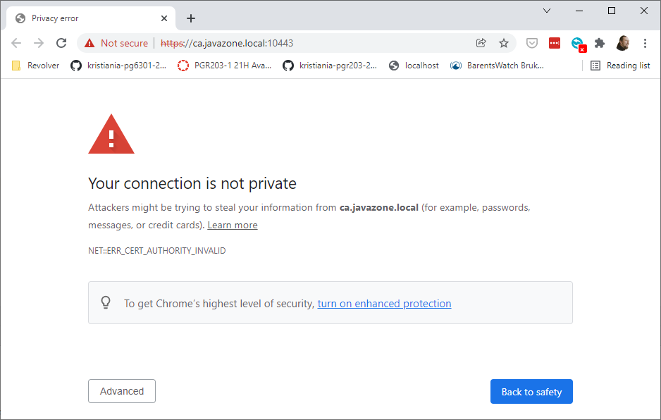
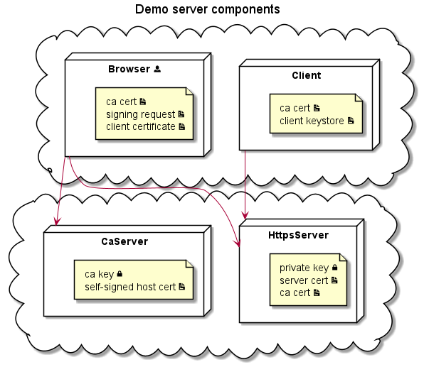
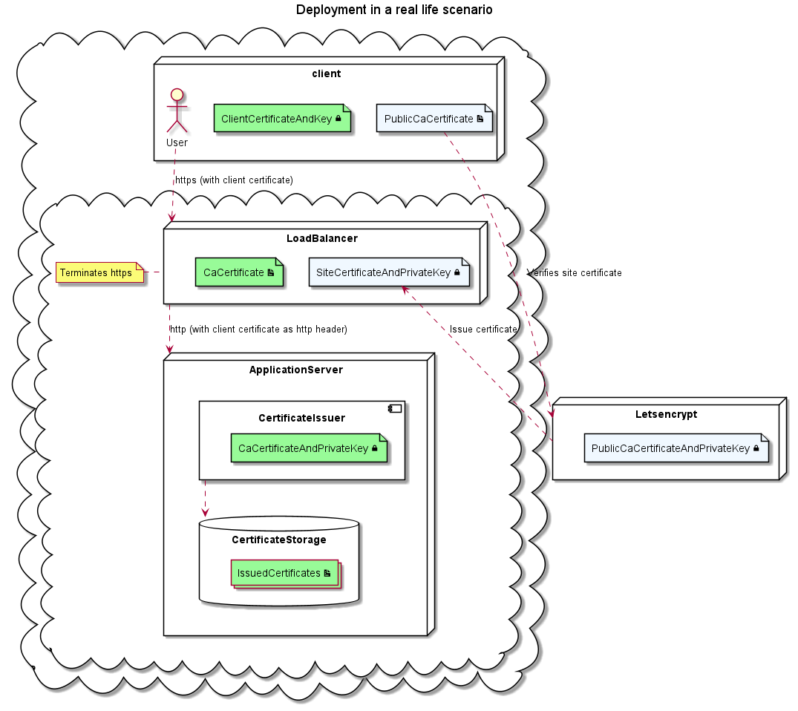

# Certificate  fun

So, I decided to make my own Certificate Authority. Kidding. Not kidding.

Private Key Infrastructure (PKI) is what creates security on the public web and to an increasing extend on internal networks as well. Yet, most developers and operations only have a superficial understanding of the technology. I aim to lay the details of the technology bare so you can understand it at any level you want.

As part of this work, I've also created a clean-room implementation of code for [building and parsing of certificates](liquidpki/README.md), including parsing and generating ASN.1 DER objects.


## What we will fix (browser edition)

When the certificate chain is not set up correctly, you get the following error on your browser:



## What we will fix (Java edition)

If you try to connect to a server with a certificate issued by an untrusted CA with a Java program, you will get something like this

```
Exception in thread "main" javax.net.ssl.SSLHandshakeException: PKIX path building failed: sun.security.provider.certpath.SunCertPathBuilderException: unable to find valid certification path to requested target
	at java.base/sun.security.ssl.Alert.createSSLException(Alert.java:131)
	at java.base/sun.security.ssl.TransportContext.fatal(TransportContext.java:320)
	at java.base/sun.security.ssl.TransportContext.fatal(TransportContext.java:263)
	at java.base/sun.security.ssl.TransportContext.fatal(TransportContext.java:258)
	at java.base/sun.security.ssl.CertificateMessage$T13CertificateConsumer.checkServerCerts(CertificateMessage.java:1324)
	at java.base/sun.security.ssl.CertificateMessage$T13CertificateConsumer.onConsumeCertificate(CertificateMessage.java:1199)
	at java.base/sun.security.ssl.CertificateMessage$T13CertificateConsumer.consume(CertificateMessage.java:1146)
	at java.base/sun.security.ssl.SSLHandshake.consume(SSLHandshake.java:392)
	at java.base/sun.security.ssl.HandshakeContext.dispatch(HandshakeContext.java:441)
	at java.base/sun.security.ssl.HandshakeContext.dispatch(HandshakeContext.java:419)
	at java.base/sun.security.ssl.TransportContext.dispatch(TransportContext.java:177)
	at java.base/sun.security.ssl.SSLTransport.decode(SSLTransport.java:164)
	at java.base/sun.security.ssl.SSLSocketImpl.decode(SSLSocketImpl.java:1180)
	at java.base/sun.security.ssl.SSLSocketImpl.readHandshakeRecord(SSLSocketImpl.java:1091)
	at java.base/sun.security.ssl.SSLSocketImpl.startHandshake(SSLSocketImpl.java:402)
	at java.base/sun.net.www.protocol.https.HttpsClient.afterConnect(HttpsClient.java:567)
	at java.base/sun.net.www.protocol.https.AbstractDelegateHttpsURLConnection.connect(AbstractDelegateHttpsURLConnection.java:187)
	at java.base/sun.net.www.protocol.http.HttpURLConnection.getInputStream0(HttpURLConnection.java:1581)
	at java.base/sun.net.www.protocol.http.HttpURLConnection.getInputStream(HttpURLConnection.java:1509)
	at java.base/java.net.HttpURLConnection.getResponseCode(HttpURLConnection.java:527)
	at java.base/sun.net.www.protocol.https.HttpsURLConnectionImpl.getResponseCode(HttpsURLConnectionImpl.java:330)
	at com.johannesbrodwall.pki.https.client.HttpsDemoClient.fetch(HttpsDemoClient.java:41)
```

# Demo goals

### Demonstration

* Generate and install Certificate from Certificate Authority
* Generate, sign and use host certificate for a http server
* Generate, sign and use client certificate for web browser
* Generate key with certificate for Java client

### Review code

* Https client
* Https server
* Issuing CSRs
* Issuing certificates


## Demo setup




## Realistic setup for a production environment

In a production environment, you will not want client browsers to receive host certificates signed by you, but rather use a public certificate authority like Letsencrypt. Also, your operations will probably have set up a ingress http proxy and router which terminates https traffic. This http ingress is where the key to the publicly issued host certificate resides.

You can still issue your own client certificates, which will let you manage certificates as application data objects and store them in the database, trigger UI or other actions on expiry, and associate certificates with access rules in your application.

For your clients to be validated with the http ingress, your internal CA root certificate must be installed at the proxy. The http ingress validates the client certificate and forwards the certificate information to the app server as an http header




## Key code takeaways

### Java code to connect as a client to an https-server

```jshelllanguage
HttpsURLConnection connection = (HttpsURLConnection) new URL(this.url, spec).openConnection();
connection.setSSLSocketFactory(sslContext.getSocketFactory());

int responseCode = connection.getResponseCode();
```

### Java code to create a SSLContext

```jshelllanguage
Optional<Path> keyStorePath;
String keyStorePassword;
String keyPassword;
Optional<Path> trustedCertificatePaths;

// Private key
KeyManager[] keyManagers = null;
if (keyStorePath.isPresent()) {
    KeyStore keyStore = KeyStore.getInstance("pkcs12");
    try (InputStream inputStream = Files.newInputStream(keyStorePath.get())) {
        keyStore.load(inputStream, keyStorePassword.toCharArray());
    }
    KeyManagerFactory keyManagerFactory = KeyManagerFactory.getInstance(KeyManagerFactory.getDefaultAlgorithm());
    keyManagerFactory.init(keyStore, keyPassword.toCharArray());
    keyManagers = keyManagerFactory.getKeyManagers();
}

// Certificate Authority
TrustManager[] trustManagers = null;
if (trustedCertificatePaths.isPresent()) {
    KeyStore trustStore = KeyStore.getInstance("pkcs12");
    trustStore.load(null, null);

    X509Certificate certificate;
    try (InputStream input = Files.newInputStream(trustedCertificatePaths.get())) {
        certificate = (X509Certificate) CertificateFactory.getInstance("X509").generateCertificate(input);
    }
    trustStore.setCertificateEntry("ca", certificate);
    TrustManagerFactory factory = TrustManagerFactory.getInstance(TrustManagerFactory.getDefaultAlgorithm());
    factory.init(trustStore);
    trustManagers = factory.getTrustManagers();
}

// SSL Context
SSLContext sslContext = SSLContext.getInstance("TLS");
sslContext.init(keyManagers, trustManagers, null);
```

### Code to generate a X509 Certificate in Java

```jshelllanguage
import sun.security.x509.X509CertInfo;

X509CertInfo certInfo = new X509CertInfo();
certInfo.set(X509CertInfo.VERSION, new CertificateVersion(CertificateVersion.V3));
certInfo.set(X509CertInfo.VALIDITY, new CertificateValidity(
        Date.from(validFrom.toInstant()),
        Date.from(validTo.toInstant())
));
certInfo.set(X509CertInfo.SERIAL_NUMBER,
        new CertificateSerialNumber(new BigInteger(64, new SecureRandom())));
certInfo.set(X509CertInfo.ALGORITHM_ID,
        new CertificateAlgorithmId(new AlgorithmId(AlgorithmId.sha512WithRSAEncryption_oid)));
certInfo.set(X509CertInfo.SUBJECT, subject);
certInfo.set(X509CertInfo.ISSUER, issuer);
certInfo.set(X509CertInfo.KEY, new CertificateX509Key(publicKey));
if (extensions.isPresent()) {
    certInfo.set(X509CertInfo.EXTENSIONS, extensions.get());
}

X509CertImpl x509Cert = new X509CertImpl(certInfo);
x509Cert.sign(caPrivateKey, "SHA512withRSA");

X509Certificate certificate = x509Cert;
```

### Packaging a certificate and key in a p12 KeyStore

```jshelllanguage
KeyPairGenerator generator = KeyPairGenerator.getInstance("RSA");
generator.initialize(2048);
KeyPair keyPair = generator.generateKeyPair();

X509Certificate certificate = certificateAuthority.issueClientCertificate(subjectName, ZonedDateTime.now(), keyPair.getPublic());

KeyStore keyStore = KeyStore.getInstance("pkcs12");
keyStore.load(null, null);
keyStore.setKeyEntry("keyAndCertificate", keyPair.getPrivate(), null, new Certificate[] { certificate });
```
